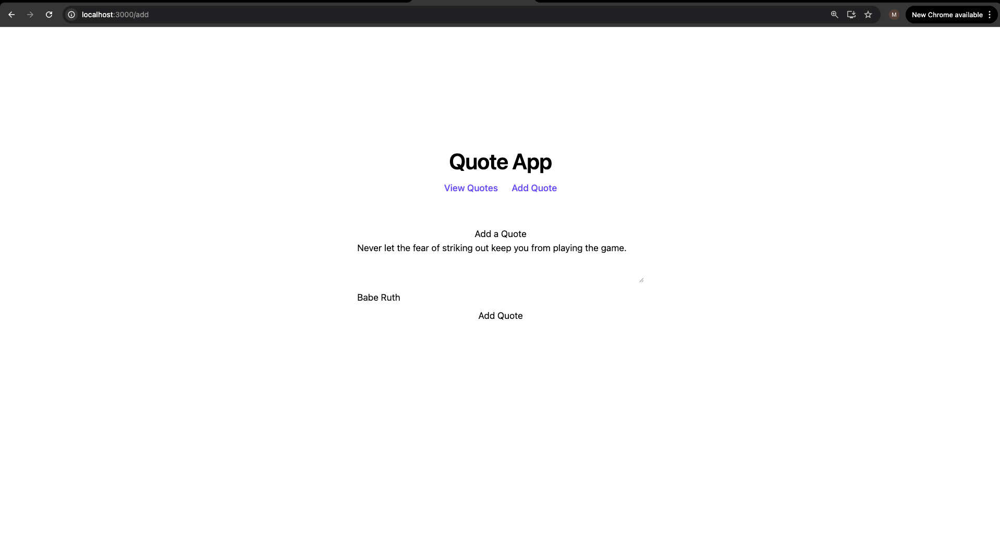

# Quote App

A clean, modern full-stack quote application built with **React + TypeScript** on the frontend and **FastAPI + SQLAlchemy** on the backend.

Users can browse inspirational quotes, add new quotes with authors, and store them persistently in a database.

---

## 📸 Screenshots

### View Quotes


### Add Quote


---
## ✨ Features

- View quotes stored in a SQLAlchemy database
- Cycle through quotes dynamically
- Add new quotes with optional authors
- Clean, centered UI with modern styling
- REST API built with FastAPI
- SQLite persistence

---

## 🧠 Tech Stack

### Frontend
- React
- TypeScript
- Tailwind CSS
- React Router

### Backend
- FastAPI
- SQLAlchemy
- SQLite
- Pydantic

---

## 📸 Screenshots

### View Quotes


### Add Quote


---

## 🚀 Getting Started

### Backend
```bash
cd backend
pip install -r requirements.txt
uvicorn main:app --reload


### Backend
```bash
cd frontend
npm install
npm start

